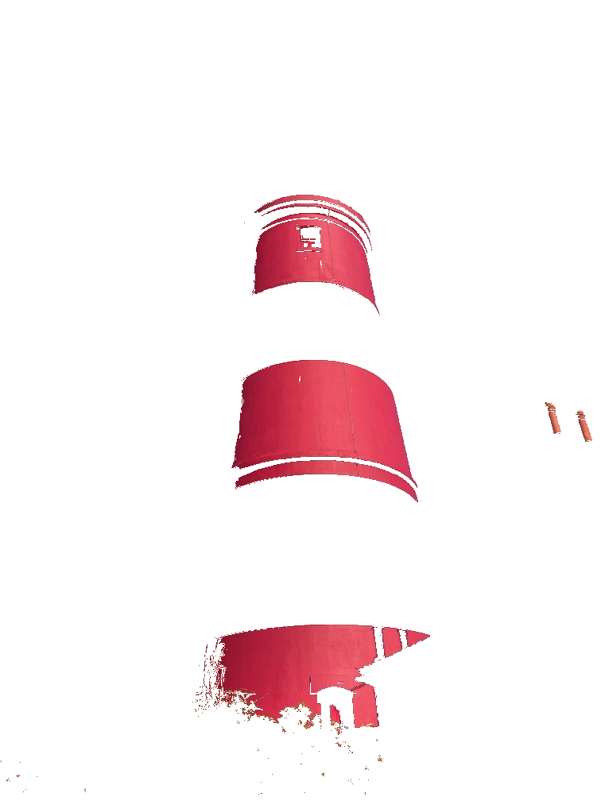

This folder has some scripts I've written that use the output of dominant colours to do interesting things.

## dominant_slices.py

This "slices" an image based on its dominant colours: each slice contains then pixels of the original image which are closest to one of the dominant colours.

```console
$ python3 dominant_slices.py lighthouse.jpg --max-colours=5
```

Example:

<table>
  <tr>
    <td>
      #e8e3d7
      
    </td>
    <td>
      #838882
      
    </td>
    <td>
      #4576bb
      
    </td>
    <td>
      #292019
      
    </td>
    <td>
      #c53b4e
      
    </td>
  </tr>
</table>
