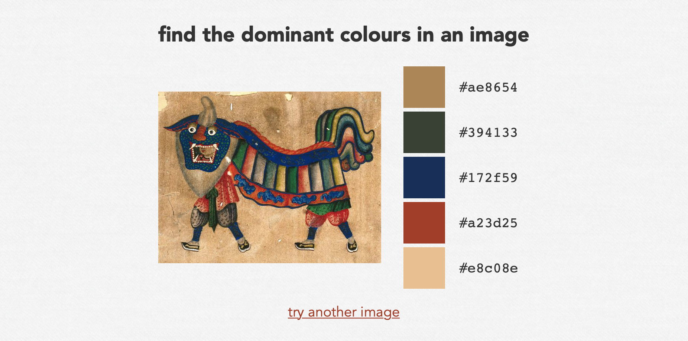

# webapp

This is a web version of [dominant_colours], which is available at <https://dominant-colours.glitch.me/>



It's not meant to replace the command-line tool -- it won't get all the options, and uploading the image over HTTP means it's a lot slower.
It's meant to be a quick replacement when I don't have easy access to a command line, e.g. when I'm on my phone.

[dominant_colours]: https://github.com/alexwlchan/dominant_colours


## How it works

It's a web app written in [Flask], which shells out to the command-line tool to process an uploaded image.
I've deployed it on [Glitch], because I already had several projects running there and I knew how to get started quickly.

I have to [compile MUSL libc-based versions][compile] of the CLI tool to get it working in Glitch.

[Flask]: https://pypi.org/project/Flask/
[Glitch]: https://glitch.com/
[compile]: https://alexwlchan.net/2022/05/rust-on-glitch/


## Development

You should only need to run the web app for development; if you can install packages locally the CLI is probably a better option.

1.  Install the [latest release] of the CLI
2.  Install the Python requirements:

    ```console
    $ pip3 install -r requirements.txt
    ```

3.  Run the web server script:

    ```console
    $ python3 server.py
    ```

This will start a debug version of the web app at <http://localhost:4711>

[latest release]: https://github.com/alexwlchan/dominant_colours/releases
